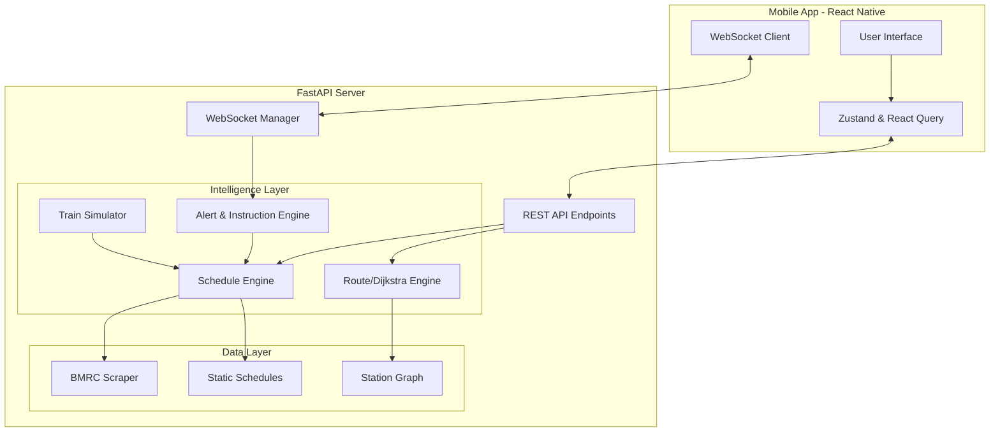

<div align="center">

# Namma Metro — Journey Companion

A complete, modern, full-stack application designed to provide commuters with an intelligent and seamless metro travel experience. It features Dijkstra-based route planning, real-time schedule computation, and live journey tracking with context-aware notifications.


</div>


---

## Vision & Problem Statement
Navigating urban transit can be stressful due to lack of real-time visibility, confusing interchanges, and unpredictable crowd levels. The **Namma Metro Journey Companion** solves this by providing commuters with an intuitive mobile app backed by an intelligent backend that computes train positions dynamically based on official schedules. The system tracks the user's journey in real-time, offering proactive instructions (e.g., "Change to Green Line at Majestic") and digital QR ticketing.

## ✨ Actual Features
- **Intelligent Route Planning:** Calculates the fastest path between stations using Dijkstra's algorithm, accounting for interchanges.
- **Real Timetable Integration:** Planners and routing use exact BMRCL schedules (peak/off-peak frequencies) rather than estimating from the current clock.
- **Multi-Option Smart Journey Planner:** Lists all upcoming trains that haven't departed yet, with exact arrival/departure times at every stop.
- **Digital Ticketing:** QR-code based ticket generation.
- **Live Journey Tracking & Companion:** Tracks the journey and provides proactive instructions (e.g., "Change to Green Line at Majestic").
- **Local & Remote Alert Engines:** Client-side fallback engine fires schedule-accurate alerts (boarding reminders, walk directions) even when offline.
- **Interactive Metro Map:** A visual interface for the Purple and Green lines.
- **Data Scraping Fallback:** Automatically scrapes official schedules, with static data fallbacks for guaranteed uptime.
- **Planned:** AI-based crowd estimation analytics.

## Getting Started & Backend Usage
If you are setting up the project for the first time, or need to connect your mobile app to the local backend, **please read the [Backend Setup & Connections Guide](BACKEND_USAGE.md)**. This guide covers `.env` setup, IP addresses, and manual tasks required by the developer.

## Tech Stack
| Component | Technologies |
| :--- | :--- |
| **Mobile (Mobile App)** | React Native, Expo, TypeScript, React Query, Zustand, React Navigation |
| **Backend (API Server)** | Python 3, FastAPI, Uvicorn, WebSockets, Pydantic, BeautifulSoup4 |

## Overall Architecture



### Frontend ↔ Backend Data Flow
1. **Initial Load:** The frontend uses React Query to fetch the station list and system health from the backend REST API.
2. **Planning:** User inputs source and destination. The backend runs Dijkstra's algorithm and queries the `ScheduleEngine` to estimate travel time and next train arrivals, returning the route segments.
3. **Ticketing:** A ticket is purchased via REST API. The backend registers an `active_journey`.
4. **Live Tracking:** The frontend opens a WebSocket connection to `/ws/journey/{journey_id}`.
5. **Real-time Push:** The backend runs a background loop, consulting the `InstructionEngine` and `AlertEngine`, pushing JSON updates to the frontend every few seconds regarding current segment progress and interchange alerts.

## 📁 Project Structure
- `mobile/` - The React Native (Expo) frontend application. (Documented in `frontend/README.md`)
- `backend/` - The FastAPI Python server. (Documented in `backend/README.md`)

## Setup & Run Commands

### Backend (FastAPI)
```bash
cd backend
python -m venv venv
source venv/bin/activate  # On Windows: venv\Scripts\activate
pip install -r requirements.txt
python main.py
```
*API running at `http://localhost:8000`*

### Frontend (React Native/Expo)
```bash
cd mobile
npm install
npm start
```
*Use the Expo Go app on your phone, or run via emulator.*

## Deployment

### Backend

The backend is fully containerized and ready for cloud deployment.
Environment variables required: `HOST`, `PORT`, `DATA_PROVIDER`, `CORS_ORIGINS`.

**Option 1: Docker Compose (VMs)**
```bash
cd backend
docker-compose up -d --build
```

**Option 2: PaaS (Render / Railway)**
A `Procfile` is included for zero-config deployments. Just connect the repository to your PaaS of choice and set the environment variables.

### Mobile App

1. Ensure the backend is deployed.
2. In the `mobile/` directory, set the `EXPO_PUBLIC_API_BASE` environment variable to your deployment URL.
3. Build for stores using Expo Application Services (EAS):
```bash
cd mobile
eas build -p all
```

## Roadmap
- [ ] Implement actual AI Crowd Estimation (currently placeholder).
- [ ] Add support for the upcoming Yellow Line.
- [ ] Multi-language support (Kannada/English UI).
- [ ] Integration with a future official BMRC Live API instead of schedule scraping.

## Detailed Documentation
Please refer to the sub-READMEs for specific, detailed information on each stack layer:
- **[Frontend Documentation](mobile/README.md)**
- **[Backend Documentation](backend/README.md)**
